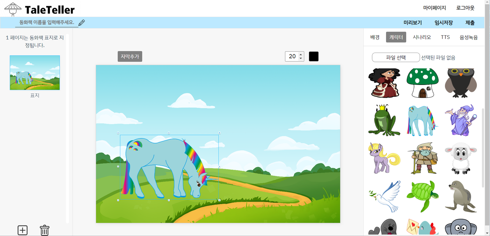
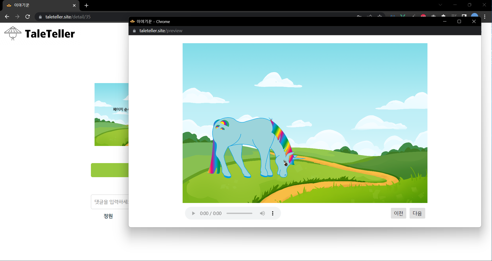

# 이야기꾼(동화책 제작툴)

- 날짜: 2023/06/27 → 2023/07/14
- 간단설명: gpt로 동화책 시나리오를 받아 직접 만들어 보는 내 동화책


```
HTML, CSS, JavaScript, Vue.js 2, Axios
Java 17, Spring Boot 2.7.8, Spring Security, Spring Data JPA, JWT
OpenAI API, Kakao API, Iamport API
MariaDB, MongoDB
GitHub action, AWS, Vercel
GitHub, Notion, Discord, IntelliJ, Visual Studio Code
```

[이야기꾼 기획기능설명.pdf](%E1%84%8B%E1%85%B5%E1%84%8B%E1%85%A3%E1%84%80%E1%85%B5%E1%84%81%E1%85%AE%E1%86%AB(%E1%84%83%E1%85%A9%E1%86%BC%E1%84%92%E1%85%AA%E1%84%8E%E1%85%A2%E1%86%A8%20%E1%84%8C%E1%85%A6%E1%84%8C%E1%85%A1%E1%86%A8%E1%84%90%E1%85%AE%E1%86%AF)%2000d67d16e8d24dfab7e5840c58feae8e/%25EC%259D%25B4%25EC%2595%25BC%25EA%25B8%25B0%25EA%25BE%25BC_%25EA%25B8%25B0%25ED%259A%258D%25EA%25B8%25B0%25EB%258A%25A5%25EC%2584%25A4%25EB%25AA%2585.pdf)


## 📄 기획 소개

- 부모님이 동화책 제작 툴을 통해 자녀를 위한 동화책을 간편하게 만들 수 있는 서비스
- **chat gpt 를 이용한 시나리오 작성, 이야기 흐름 파악**
- **추가한 자막에 다양한 tts 또는 내 목소리를 녹음해 들을 수 있는 기능**
- 완성된 작품은 사이트에서 감상할 수 있습니다.

## 📄기능

- 제작 툴
  - 시나리오 선택 및 흐름 파악
    - 키워드 입력받아서 시나리오 작성
    - 시나리오 다시 받기
    - 흐름 파악
  - 감상 미리보기
    - 페이지 추가/이동/삭제
    - 미리 보기
  - 캐릭터/배경/자막
    - 캐릭터/배경/자막 추가
    - 파일 업로드
  - 녹음 / TTS
    - 본인의 목소리 직접 녹음 가능
    - 여자아이, 남자아이, 할머니, 할아버지 등 모든 목소리 지원
- 사이트
  - 작품감상
  - 작품 결제, 엽전 충전, 환급
  - 작품 통계 제공


## 📄 툴 스토리보드


## 📄 DB 설계


## 🖥️ CI/CD 구축

- GitHub에 푸시하고 메인에 머지되면 GitHub Action을 통해 yml 파일이 실행됩니다.
- 백엔드를 Build 하고, 압축파일을 AWS S3에 업로드 후 CodeDeploy를 이용해 EC2에 배포되게 구축하였습니다.


## 🖥️ 프론트 엔드 배포


- 프론트엔드는 Vercel을 이용하여 깃허브와 연동시켜두었습니다.


## 🖥️ 백엔드 서비스 아키텍처

- 도메인을 Route53으로 연결하고, HTTPS 로 전환하기위해 인증서를 받아 EC2에 연결하였습니다.
- HTTP로 들어온 주소는 HTTPS로 바꾸기 위해 Nginx 를 사용하였고, DB는 RDS에 MariaDB, mongoDB Atlas로 mongoDB를 연결하였습니다.
- 서비스의 모든 파일은 S3에 Presigned Url을 발급 받고 클라이언트 측에서 업로드하는 방식을 사용하여 서버에 많은 부하가 가지 않도록 했습니다.


## 📖 실행 화면

### 메인

- 메인페이지의 메뉴에는 인기순, 최신순, 만들어보기(툴로 이동) 가 있습니다.


### 툴 진입 시 미완성 작품 리스트

- 만들어보기 진입 시,
  새로운 동화책을 만들 수 있고, 기존에 만들다 만 작품을 불러와 작업할 수 있습니다.


### 툴 진입 후

- 시나리오 추천 받기를 클릭하면 OpenAI API를 통해 시나리오를 받을 수 있고,
  직접 쓰기를 클릭하면 본인이 직접 내용을 작성하면 됩니다.


### 툴 시나리오 제공 받기

- Open AI API 는 받아오는 데 시간이 조금 걸리기 때문에 로딩이 되고, 이 때 다른 작업을 다 할 수 있습니다.


### 흐름파악하기


### 배경 / 캐릭터 / 자막 / 페이지 / TTS / 음성 녹음 / 감상

- 배경, 캐릭터, 페이지를 드래그 앤 드롭으로 추가할 수 있습니다.



- 캐릭터와 배경은 크기 조절 및 순서 변경이 가능합니다.


- 자막은 크기 조절 및 색상 변경도 가능하며, 다양한 목소리의 TTS도 추가할 수 있습니다.


- 페이지도 순서 이동 및 삭제가 가능하고, TTS 대신 직접 녹음도 할 수 있습니다.


- 만든 페이지들을 미리보기가 가능하고, 저장된 음성은 자동 재생됩니다.


### 작품 제출

- 해당 작품을 제출하면 메인에 노출되어 많은 사람들이 감상할 수 있습니다.


### 작품 상세 페이지

- 작가가 아닌 다른 사람은 추천, 즐겨찾기, 댓글 작성이 가능하며, 결제 후 감상도 가능합니다.




### 마이 페이지 - 충전은 카카오 페이, 카드 결제, 무통장 입금

- 엽전(코인)을 충전할 수 있고 내역을 볼 수 있습니다.
- 충전은 카카오 페이, 카드 결제, 무통장 입금이 가능합니다.


### 작품 관리 및 회원 정보 관리

- 내가 만든 작품, 즐겨찾기한 작품, 결제한 작품 리스트를 볼 수 있습니다.


